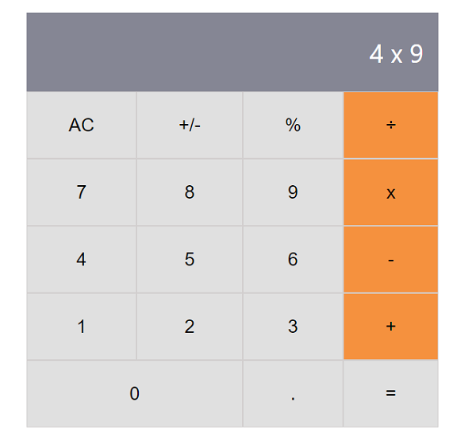

# Math Magicians

> This is the first milestone of the project to setup a React application using React documentation.



Additional description about the project and its features.

## Built With

- Major languages: HTML, CSS, Javascript
- Frameworks: React
- Technologies used: Webpack, babel

## Live Demo

[Live Demo Link](https://livedemo.com)


## Getting Started

1. To get a local copy up and running follow these simple steps.
```bash
git@github.com:Fikerte-T/math-magicians2.git
```
2. To install npm, run the following command in your terminal, in the project directory
```bash
npm install
```
3. To run the app in the development mode
 ```bash
 npm start
 ```
Open [http://localhost:3000](http://localhost:3000) to view it in the browser.

## Author

👤 **Fikerte T.**

- GitHub: [@Fikerte-T](https://github.com/Fikerte-T)
- Twitter: [@tofikertesfaye](https://twitter.com/tofikertesfaye)
- LinkedIn: [LinkedIn](https://www.linkedin.com/in/fikerte-tesfaye-a68337216/)

## 🤝 Contributing

Any feature requests and contributions are welcome!!

Check the issues page [here](https://github.com/Fikerte-T/math-magicians/issues).

## Show your support

Give a 👍 👍 if you approve this project!


## Acknowledgments

- [Create React App documentation](https://github.com/facebook/create-react-app#create-react-app--)

## 📝 License

This project is [MIT](./MIT.md) licensed.
